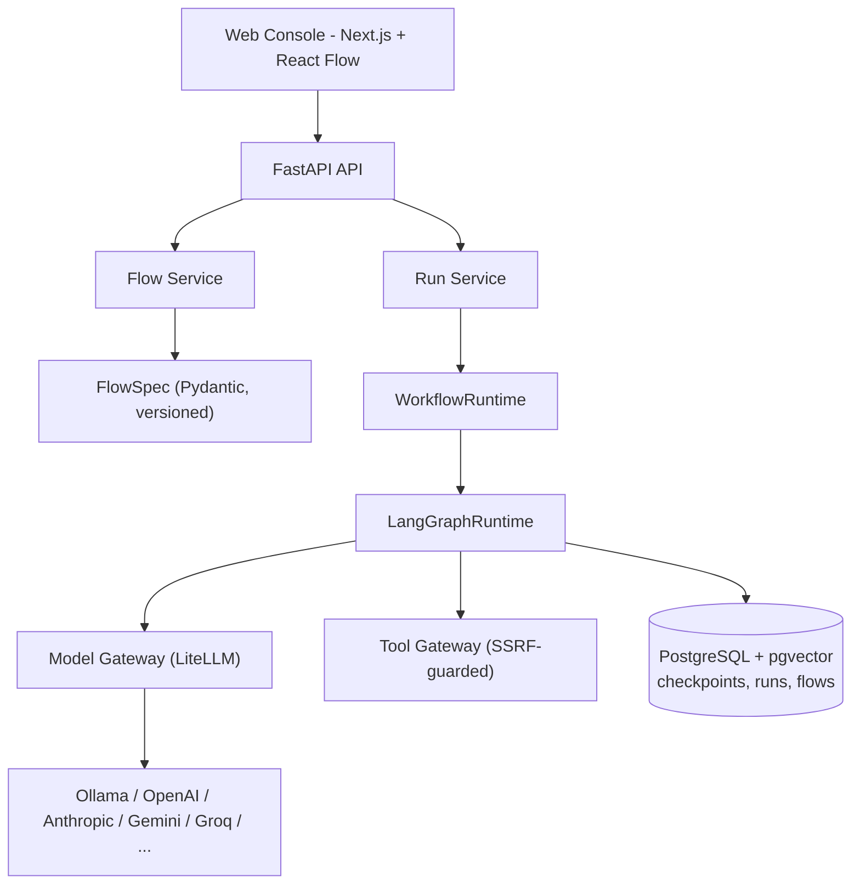

# AgentQ

**The engineering control plane for enterprise AI agents.** Build, test, secure, deploy,
observe, and optimize multi-agent systems - with a real execution engine, a real flight recorder,
and a real database underneath the canvas, not just a drag-and-drop demo.


## Why AgentQ

Most visual agent builders stop at "it ran once in a demo." AgentQ is built around what
breaks when agents hit production:

- **Agent execution flight recorder** - every run, node, model call, tool call, token, and
  dollar is persisted (`runs` / `run_steps` / `run_events`), not just streamed and discarded.
- **True human-in-the-loop** - approval nodes pause via a real LangGraph interrupt on a
  Postgres-backed checkpoint. Kill the API process mid-approval, restart it, and the run resumes
  exactly where it paused.
- **Framework-neutral spec** - the canvas persists **FlowSpec**, never LangGraph internals, so
  a CrewAI/AutoGen/custom-Python execution adapter can be added later without touching the UI.
- **Model independence** - one gateway (LiteLLM) in front of every provider, plus a zero-network
  MockLLM so the whole platform boots and every test passes with no API key.
- **Security by construction** - SSRF-guarded HTTP tools, no `eval()` on user input (a real AST
  walker for router/approval expressions instead), secrets stored encrypted and referenced only
  by `secret_id`, workspace-scoped data model from day one.

## Feature Matrix

| Capability | Status |
|---|---|
| Visual builder (React Flow canvas, node library, inspector) | ✅ |
| FlowSpec (typed, versioned, validated) | ✅ |
| LangGraph execution engine + streaming trace | ✅ |
| Agent, Router, Supervisor, Tool, Human Approval nodes | ✅ |
| Replay a completed run | ✅ |
| MockLLM + LiteLLM gateway (OpenAI/Anthropic/Gemini/Groq/OpenRouter/Bedrock/Ollama/custom) | ✅ |
| Model catalog search (live OpenRouter-sourced, top-5-free quick pick) | ✅ |
| AI Architect (NL → FlowSpec, bounded self-repair loop) | ✅ |
| RAG (real ingestion + pgvector retrieval) | ✅ |
| Memory (conversation + semantic, pgvector-backed) | ✅ |
| MCP registry (real JSON-RPC client, tool discovery) | ✅ |
| Evaluation datasets/evaluators/runs (7 evaluator types) | ✅ |
| PolicyEngine (tool deny-list), guardrails (6 check types), audit log | ✅ |
| Production dashboard (cost/latency/model usage) | ✅ MVP lite (real aggregates, no fake metrics) |
| Prometheus `/metrics` (real counters across the whole run lifecycle) | ✅ |

See [`IMPLEMENTATION_PLAN.md`](IMPLEMENTATION_PLAN.md) for the acceptance test behind every ✅.

## Architecture



FlowSpec is the only thing the canvas ever serializes - the compiler is what turns it into a
LangGraph `StateGraph`, so a second runtime adapter (CrewAI, AutoGen, custom Python) can be added
without changing the UI or the stored data. See
[`docs/architecture/execution-engine.md`](docs/architecture/execution-engine.md).


<h2 align="center">AgentQ Platform Preview</h2>

<p align="center">
  <a href="https://github.com/TravelXML/AI-AgentOps-Studio/blob/main/AgentQ-Enterprise-Agent-Engineering-Platform-08-24-2026_01_07_PM%20%281%29.png">
    
  </a>

  <a href="https://github.com/TravelXML/AI-AgentOps-Studio/blob/main/AgentQ-Enterprise-Agent-Engineering-Platform-08-24-2026_01_07_PM.png">
    
  </a>
</p>

<p align="center">
  <a href="https://github.com/TravelXML/AI-AgentOps-Studio/blob/main/AgentQ-Enterprise-Agent-Engineering-Platform-08-24-2026_01_09_PM.png">
    
  </a>

  <a href="https://github.com/TravelXML/AI-AgentOps-Studio/blob/main/AgentQ-Enterprise-Agent-Engineering-Platform-08-24-2026_01_10_PM.png">
    
  </a>
</p>

<p align="center">
  <a href="https://github.com/TravelXML/AI-AgentOps-Studio/blob/main/AgentQ-Enterprise-Agent-Engineering-Platform-08-24-2026_01_16_PM.png">
    
  </a>

  <a href="https://github.com/TravelXML/AI-AgentOps-Studio/blob/main/AgentQ-Enterprise-Agent-Engineering-Platform-08-24-2026_01_17_PM.png">
    
  </a>
</p>

<p align="center">
  <sub>Click any screenshot to view it full size.</sub>
</p>

## Quick Start

```bash
git clone <this-repo>
cd AI-AgentOps-Studio
cp .env.example .env
docker compose up -d
```

Then:

1. Open **http://localhost:3000**
2. `make seed` (or `uv run python infrastructure/scripts/seed_examples.py`) to load 15 example
   flows into the UI - one for every node type, plus a 5-flow customer-support template pack
   that's actually business-shaped (ticket triage, escalation, refunds), not just a node demo
3. Open **Simple Agent**, click **Run** - no API key needed, it uses a free built-in mock model
4. Open the trace link to see per-node timing, tokens, and cost

New to AI agent builders entirely? **[`docs/USER_GUIDE.md`](docs/USER_GUIDE.md)** explains the
whole app in plain language, no prior knowledge assumed.

API docs (OpenAPI/Swagger): **http://localhost:8000/docs**

### Example flows

`examples/` (see [`examples/README.md`](examples/README.md)) has one flow per node type -
Calculator Tool, Raw LLM Call, Guardrail Demo, Conversation Memory, RAG Q&A, MCP Tool Call, plus
the original vertical slice, router, supervisor, and human-approval examples - and a 5-flow
customer-support template pack (`business-*`) built to look like something you'd actually run:
ticket triage, sentiment-aware escalation, order lookup, a tiered refund policy, and a real
help-center RAG assistant. `make seed` loads all of them, including seeding two knowledge bases
and registering the bundled demo MCP server - no manual setup needed to try any of them.

The human-approval one is worth calling out specifically: a refund agent drafts a decision, then
pauses for human approval on amounts over $500. Run it, approve or reject from the trace page, and
watch the run resume. Kill and restart the `api` container mid-approval - the paused run survives,
because it's backed by a real Postgres checkpoint, not frontend state.

## Technology Stack

**Frontend:** Next.js 15, React 19, TypeScript, `@xyflow/react`, Tailwind CSS, Zustand, TanStack
Query, Zod

**Backend:** Python 3.12, FastAPI, Pydantic v2, SQLAlchemy 2 (async), Alembic, LangGraph,
LiteLLM, PostgreSQL + pgvector, Redis, structlog, OpenTelemetry-ready metrics (Prometheus)

## Project Structure

```text
apps/
  web/            Next.js visual builder, trace UI, dashboard
  api/            FastAPI app - routers, services, DB models, Alembic migrations
packages/
  flowspec/       FlowSpec schema + validation (framework-neutral)
  runtime/        WorkflowRuntime abstraction + LangGraph adapter + built-in tools
  model_gateway/  LiteLLM gateway + MockLLM
  evaluation/     Evaluators (exact/contains/regex/schema/latency/cost/LLM-judge)
  security/       PolicyEngine, guardrail checks, secrets abstraction
  observability/  Structured logging + Prometheus metrics
  sdk/            Client SDK (future public package - stub)
infrastructure/
  docker/         Dockerfiles, Postgres init
  scripts/        seed_examples.py
examples/         Four working FlowSpec examples (see Feature Matrix)
tests/e2e/        Playwright end-to-end tests (MockLLM, no API key needed)
docs/             Architecture notes, ADRs, API overview, dev guides
```

## Development

```bash
make install   # uv sync + npm install (web) + npm install (e2e)
make dev       # Postgres + Redis via Docker, API + web dev servers locally
make test      # pytest (backend) + typecheck/lint (frontend)
make test-e2e  # Playwright, against already-running dev servers
make lint      # ruff + eslint + tsc
make migrate   # apply Alembic migrations
make seed      # load example flows
```

See [`docs/development/local-development.md`](docs/development/local-development.md) for details,
and [`docs/development/creating-node.md`](docs/development/creating-node.md) /
[`creating-tool.md`](docs/development/creating-tool.md) to extend the platform.

## Testing

- **Backend:** pytest + pytest-asyncio + httpx `AsyncClient` against the real ASGI app and a real
  Postgres test database - 34+ tests covering FlowSpec validation, the compiler, the model
  gateway, and the full API (flows, runs, streaming, human approval, replay).
- **Frontend:** `tsc --noEmit` + ESLint; production build verified.
- **E2E:** Playwright drives the actual browser - drag nodes onto the canvas, connect them,
  configure an agent, save, run, watch nodes glow through their execution states, open the trace.
  Runs against MockLLM, so CI needs no API key. This is also how a genuine cross-origin CORS bug
  (a custom response header the UI depends on wasn't exposed to browser JS) was caught - the kind
  of bug that same-process API tests structurally cannot see.

## Security

See [`SECURITY.md`](SECURITY.md) and [`docs/architecture/security.md`](docs/architecture/security.md).
Highlights: SSRF-guarded HTTP tools (blocks localhost/private/link-local/cloud-metadata targets),
no `eval()` anywhere (router/guardrail expressions run through a restricted AST walker), secrets
encrypted at rest and referenced only by `secret_id` (never in FlowSpec, logs, or traces).

## Roadmap

See [`ROADMAP.md`](ROADMAP.md).

## Contributing

See [`CONTRIBUTING.md`](CONTRIBUTING.md).

## License

[MIT](LICENSE).
