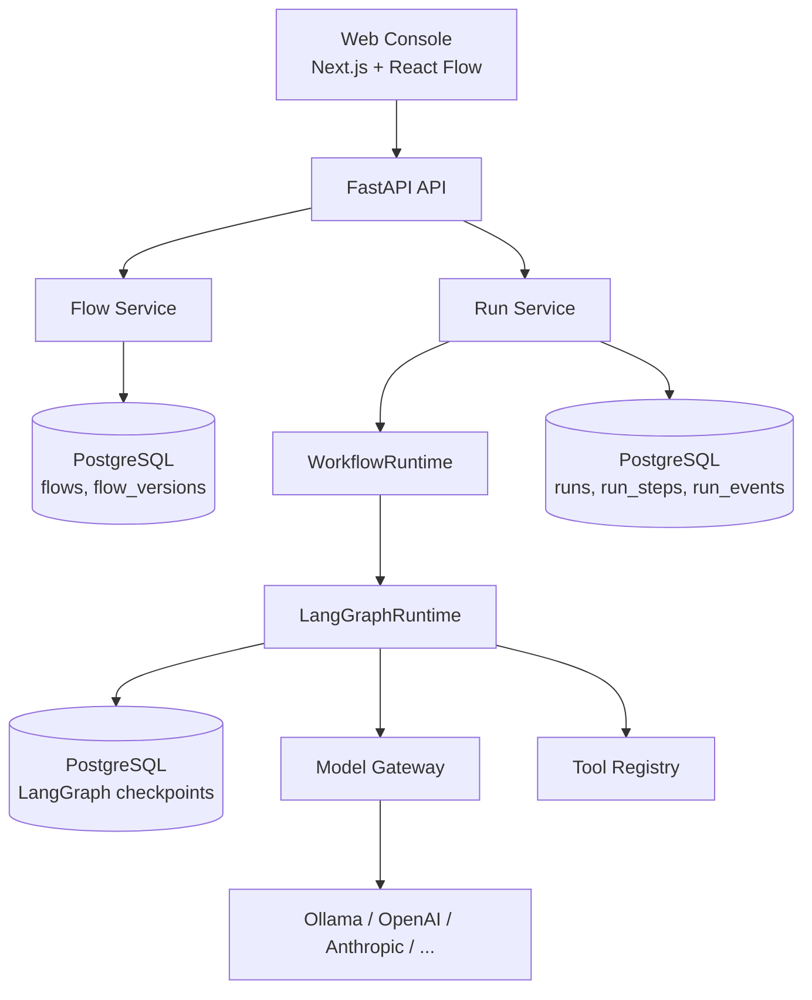

# System Overview

AgentQ is a monorepo with a clean separation between the framework-neutral workflow
specification (FlowSpec), the runtime that executes it (LangGraph today, pluggable later), and the
API/UI layers that never see runtime internals directly.

## Request lifecycle: running a flow

1. Client `POST /api/v1/flows/{id}/runs` with `{"inputs": {...}}`.
2. `RunExecutionService` loads the flow's latest `FlowVersion`, builds a `ModelGateway` from the
   workspace's `model_configs` (falling back to MockLLM for anything unconfigured), and compiles
   the `FlowSpec` into a LangGraph `StateGraph` via `FlowCompiler`.
3. `LangGraphRuntime.execute()` drives the compiled graph in a background asyncio task, forwarding
   every node-emitted event through a queue.
4. Each event is persisted (`RunEvent`, plus `RunStep` bookkeeping keyed by node id) and streamed
   to the client as a Server-Sent Event, in the same request/response cycle - there's no separate
   background worker for the vertical slice's execution model.
5. If a Human Approval node is reached, LangGraph's `interrupt()` pauses the graph; the run's
   status becomes `WAITING_FOR_HUMAN` and the SSE stream ends. Because the graph is compiled with
   a **Postgres-backed checkpointer**, this pause survives an API process restart.
6. `POST /api/v1/runs/{id}/resume` re-compiles the same FlowSpec and resumes the same LangGraph
   thread (keyed by `run_id`) from its checkpoint via `Command(resume=...)`.

## Why FlowSpec is the boundary

The canvas never stores LangGraph nodes/edges/state directly. It stores FlowSpec - a plain,
versioned, Pydantic-validated document. `FlowCompiler` is the only thing that knows how to turn
FlowSpec into a LangGraph `StateGraph`. This means:

- A second runtime adapter (CrewAI, AutoGen, custom Python) can be added without touching the UI,
  the database schema, or any existing flow's stored spec.
- FlowSpec can be exported/imported/diffed/versioned as ordinary JSON.
- The "Generate with AI" feature (Phase 3) only ever needs to produce valid FlowSpec - never
  runtime-specific code.

See [`flowspec.md`](flowspec.md) and [`execution-engine.md`](execution-engine.md) for detail.
